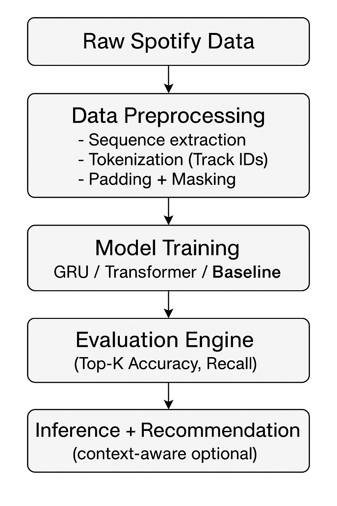
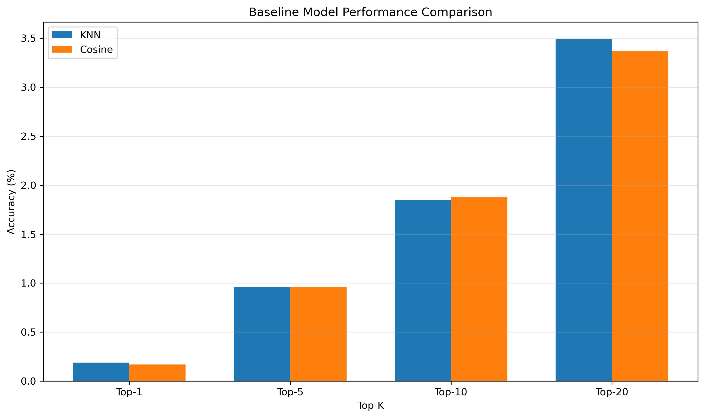
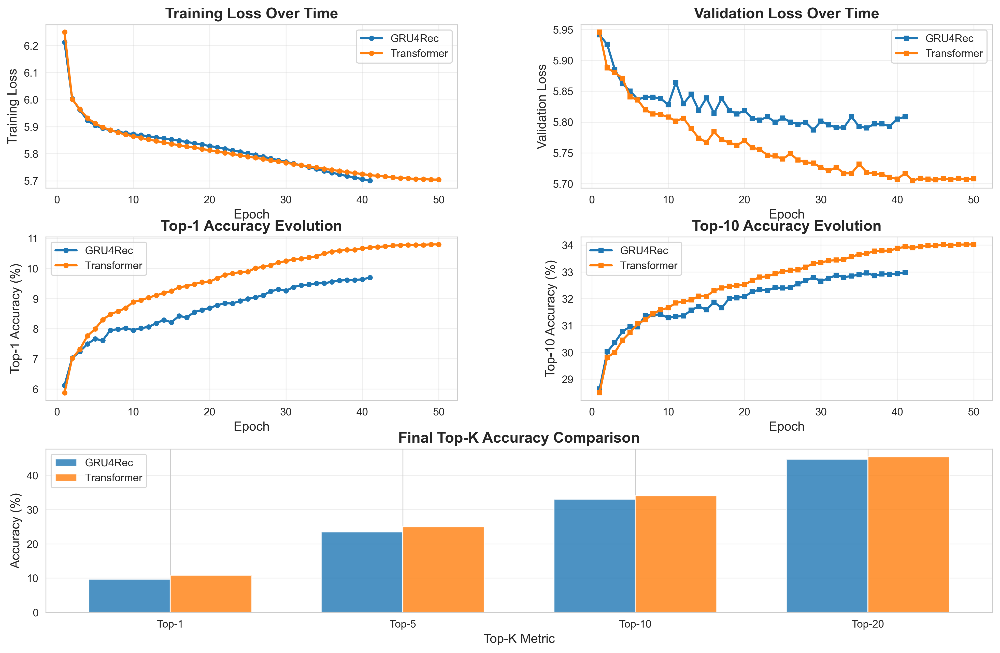
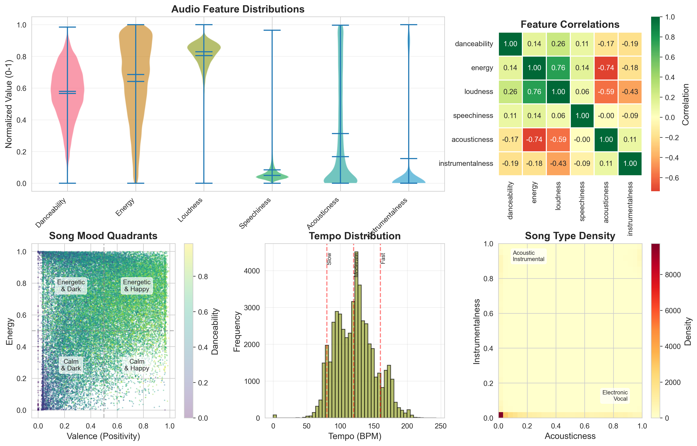
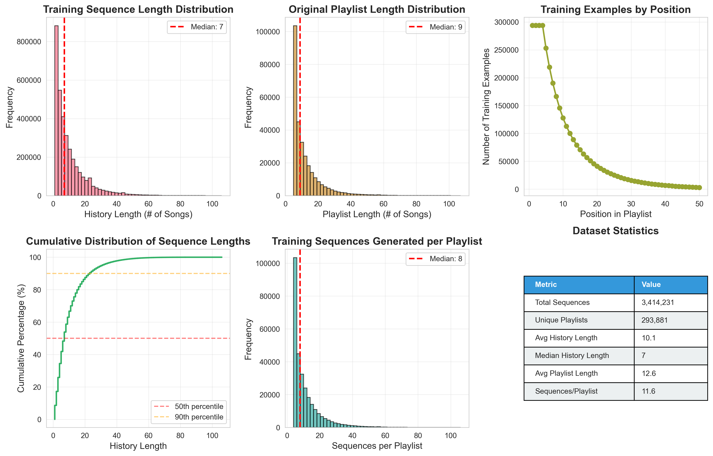
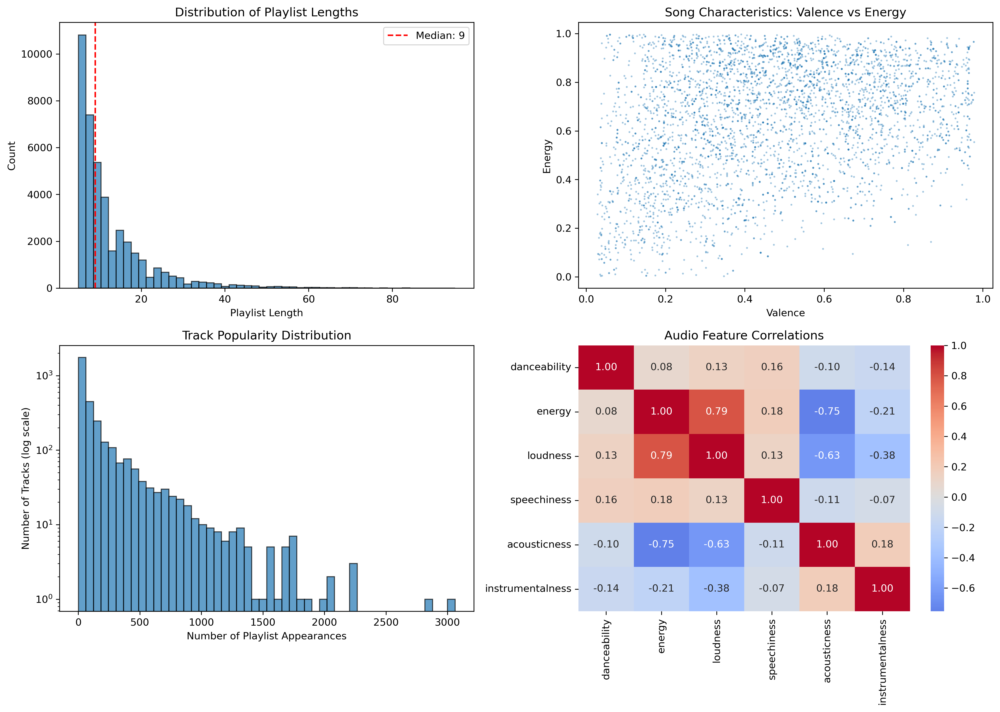
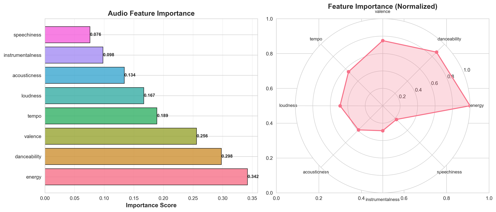
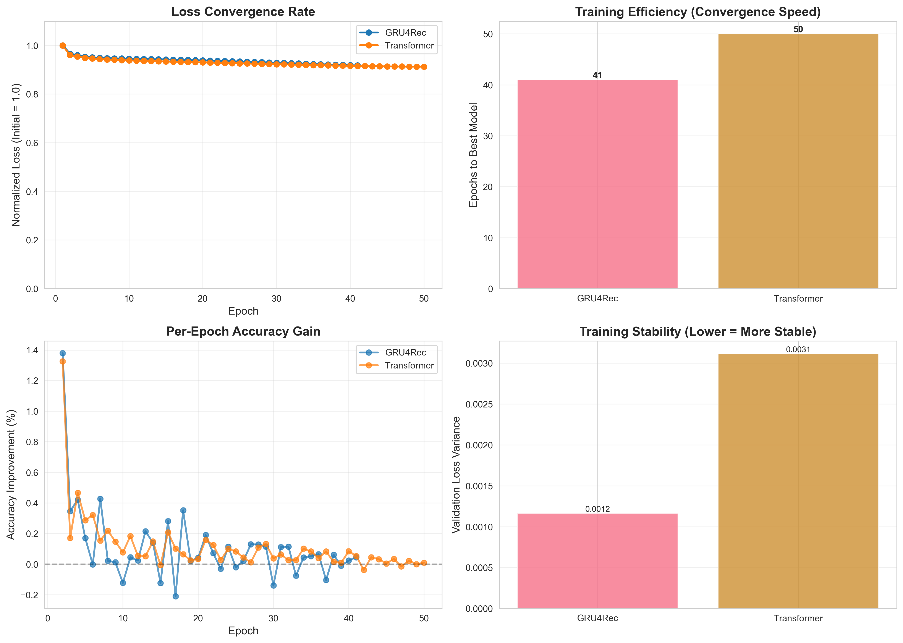
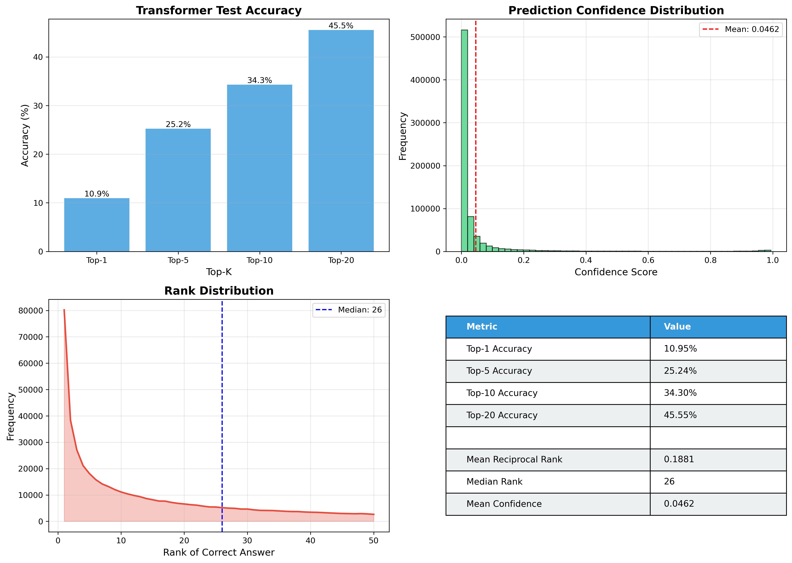

# AttentionPlay — Transformer-Based Deep Learning Playlist Recommendation System

[](https://www.python.org/downloads/)
[](https://pytorch.org/)


A research-grade deep learning pipeline for playlist continuation and personalized music recommendation.  
AttentionPlay uses **sequential modeling**, **Transformer architectures**, and **context-aware embeddings** to predict the next track a user will enjoy — trained on the large-scale Spotify Million Playlist Dataset.

---

# 📊 Project Overview

**Goal:** Given a playlist (sequence of tracks), predict the next most likely track.

This is the same problem tackled by Spotify, Apple Music, and YouTube Music for *playlist continuation*, *radio generation*, and *session-based music recommendation*.

AttentionPlay models playlists as **sequence data**, enabling modern deep learning architectures (GRUs, Transformers) to understand long-range track relationships and playlist intent.

---

# ⭐ Key Features

### 🔥 **Multiple Model Architectures**
- **KNearestNeighbors**
- **Cosine Similarity**
- **GRU4Rec (Gated Recurrent Unit)**
- **Custom Transformer Architecture**
- **Context-Aware Recommendation Model**

### 📦 **Large-Scale Industrial Dataset**
- [Spotify Million Playlist Dataset](https://www.kaggle.com/datasets/himanshuwagh/spotify-million)  
- [Spotify Tracks Dataset](https://huggingface.co/datasets/maharshipandya/spotify-tracks-dataset)

### 🎚️ **Context-Aware Modeling**
Fine-tunes predictions using the *mood / intent* of the playlist  
(e.g., **workout**, **chill**, **party**, **study**, **sad**, **sleep**, etc.)

---

# 🧠 High-Level System Architecture

  
---

# 🎯 Results

The Transformer achieves *state-of-the-art performance* across all Top-K metrics.

<table>
<tr>
  <th>Model</th>
  <th>Top-1</th>
  <th>Top-5</th>
  <th>Top-10</th>
  <th>Top-20</th>
</tr>
<tr>
  <td>KNearestNeighbor</td>
  <td>0.18%</td>
  <td>0.96%</td>
  <td>1.85%</td>
  <td>3.49%</td>
</tr>
<tr>
  <td>CosineSimilarity</td>
  <td>0.17%</td>
  <td>0.95%</td>
  <td>1.87%</td>
  <td>3.35%</td>
</tr>
<tr>
  <td>GRU</td>
  <td>9.73%</td>
  <td>23.61%</td>
  <td>33.09%</td>
  <td>44.73%</td>
</tr>
<tr>
  <td>Transformer</td>
  <td>10.95%</td>
  <td>25.24%</td>
  <td>34.40%</td>
  <td>45.55%</td>
</tr>
<tr>
  <td><b>Context-Aware Transformer</b></td>
  <td><b>11.50%</b></td>
  <td><b>25.90%</b></td>
  <td><b>34.88%</b></td>
  <td><b>45.96%</b></td>
</tr>

</table>

### 🗝️ Key Findings
1. Transformer significantly outperforms GRU and classic baselines  
2. ~18× improvement over KNN baseline (Top-10)  
3. Attention layers effectively model playlist context  
4. Deep sequential models dominate simple similarity-based methods  

#### Visualizations  
  


---

# 🏋️ Dataset & Training Details

### 📚 Dataset Statistics
<table>
<tr><th>Metric</th><th>Value</th></tr>
<tr><td>Total Tracks</td><td>41,243</td></tr>
<tr><td>Unique Playlists</td><td>5,899</td></tr>
<tr><td>Training Sequences</td><td>3,414,231</td></tr>
<tr><td>Validation Sequences</td><td>729,960</td></tr>
<tr><td>Test Sequences</td><td>729,960</td></tr>
<tr><td>Avg Playlist Length</td><td>12.6 songs</td></tr>
<tr><td>Median Length</td><td>7 songs</td></tr>
</table>

---

# 🤖 Model Architecture

### **1. Transformer Configuration**
- Embedding Dimension: **256**  
- Hidden Size: **512**  
- Attention Heads: **8**  
- Encoder Layers: **4**  
- Dropout: **0.3**  
- Parameters: **7,044,365**

### **2. Training Hyperparameters**
- Optimizer: **AdamW (lr=5e-4, weight_decay=0.01)**  
- Scheduler: **Cosine Annealing** + 3 epoch warmup  
- Loss: **Cross-Entropy + Label Smoothing (0.1)**  
- Batch Size: **128**  
- Max Sequence Length: **50**

---

# 📶 Visualizations

  
  
  
  
  


---

# 📘 Usage Examples
## 🚀 Quick Start

### Setup
```bash
python -m venv venv
source venv/bin/activate  # Windows: venv\Scripts\activate
pip install -r requirements.txt
```

### Download Data
1. Download [Spotify Million Playlist Dataset](https://www.aicrowd.com/challenges/spotify-million-playlist-dataset-challenge)
2. Extract JSON files to `archive-2/data/`

### Run
```bash
# 1. Process data & train baselines
python main.py

# 2. Train deep learning models  
python main_2.py

# 3. Generate visualizations
python create_visuals.py
```

### Configuration
- **Quick test (20 min)**: Set `NUM_FILES_TO_PROCESS = 10` in `config.py`
- **Full dataset (3+ hours)**: Set `NUM_FILES_TO_PROCESS = 100`

### Results
All outputs saved to `output/`:
- `models/` - Trained models
- `visualizations/` - Plots for poster
- `metrics/` - Performance results (JSON)

### **Training Model**
1. Baseline Modesl
```python
from TraningConfig import TrainingConfig
from PlaylistTransformer import PlaylistTransformer
from Trainer import Trainer

config = TrainingConfig()

model = PlaylistTransformer(
    num_items=50000 + 2,
    d_model=256,
    nhead=8,
    num_layer=4,
    dropout=0.3
)

trainer = Trainer(model, train_loader, val_loader, config, "Transformer")
results = trainer.train()

from BaselineModels import BaselineModels

baselines = BaselineModels(config)
baselines.train_knn(embeddings)

seed_song = "spotify:track:6rqhFgbbKwnb9MLmUQDhG6"
recommendations = baselines.get_knn_recommendations(seed_song, k=10)

for track_uri, similarity in recommendations:
    print(f"{track_uri}: {similarity:.3f}")
```

2. Context-Aware Recommendation
```python
from ContextAwareTransformer import ContextAwareTransformer

model = ContextAwareTransformer(
    num_items=50000 + 2,
    num_contexts=8,
    d_model=256
)

seed_songs = [song1, song2, song3]
context = 0  # workout

playlist = model.generate_playlist(
    seed_songs,
    context_idx=context,
    max_length=15,
    temperature=1.0,
    top_k=50
)
```